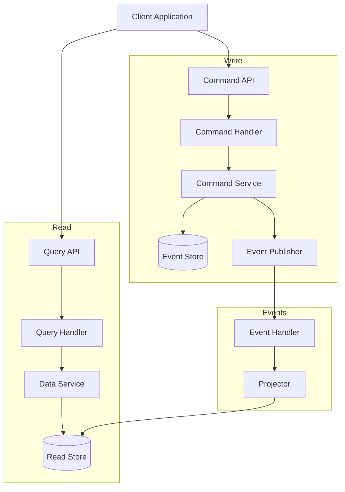
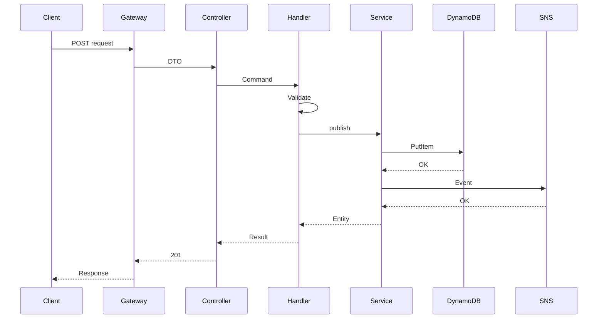
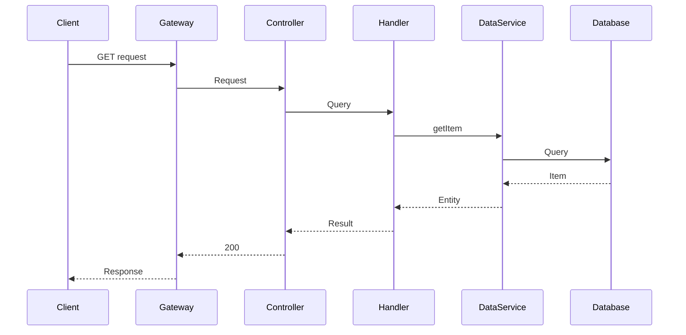

# CQRS Pattern Flow

This document illustrates the Command Query Responsibility Segregation (CQRS) pattern implementation in MBC CQRS Serverless.

## CQRS Overview



## Command Flow - Write Path



### Command Flow Steps

1. **Request Reception**: Client sends POST/PUT/DELETE request
2. **DTO Validation**: Controller validates input using class-validator
3. **Command Dispatch**: Controller creates and dispatches command
4. **Business Logic**: Command handler executes business rules
5. **Persistence**: Command service persists to DynamoDB with optimistic locking
6. **Event Publishing**: Domain event published to SNS
7. **Response**: Success response returned to client

## Query Flow - Read Path



### Query Flow Steps

1. **Request Reception**: Client sends GET request
2. **Query Dispatch**: Controller creates and dispatches query
3. **Data Retrieval**: Query handler calls data service
4. **Database Query**: Data service queries DynamoDB or RDS
5. **Response**: Data returned to client

## Key Components

### Command Handler

```typescript
@CommandHandler(CreateResourceCommand)
export class CreateResourceHandler
  implements ICommandHandler<CreateResourceCommand> {

  constructor(private readonly commandService: CommandService) {}

  async execute(command: CreateResourceCommand): Promise<DataEntity> {
    // 1. Validate business rules
    // 2. Create entity
    // 3. Persist and publish event
    return this.commandService.publish(entity);
  }
}
```

### Query Handler

```typescript
@QueryHandler(GetResourceQuery)
export class GetResourceHandler
  implements IQueryHandler<GetResourceQuery> {

  constructor(private readonly dataService: DataService) {}

  async execute(query: GetResourceQuery): Promise<DataEntity> {
    return this.dataService.getItem({
      pk: query.pk,
      sk: query.sk,
    });
  }
}
```

## Benefits of CQRS

- **Scalability**: Read and write sides can scale independently
- **Optimization**: Each side optimized for its specific purpose
- **Flexibility**: Different data models for reads and writes
- **Performance**: Read models denormalized for fast queries
- **Auditability**: Complete event history for audit trails
