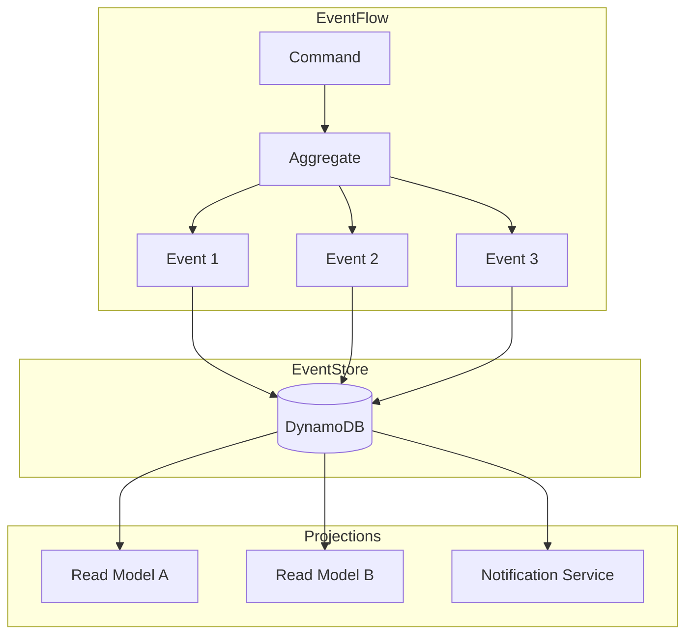
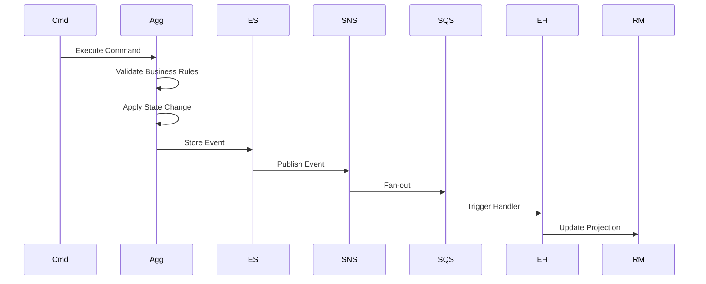
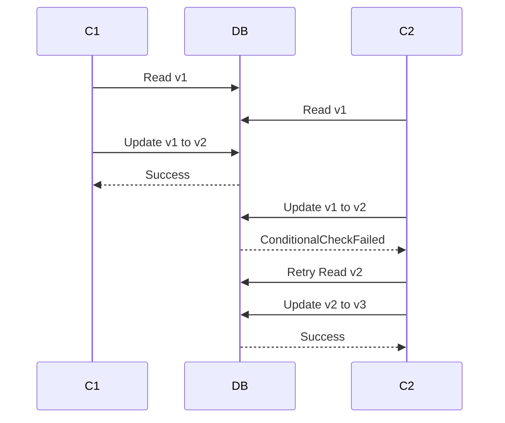
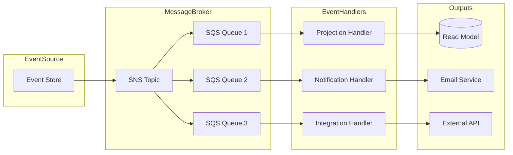

# Event Sourcing Pattern

This document describes the Event Sourcing implementation in MBC CQRS Serverless.

## Event Sourcing Overview



## Event Lifecycle



## DynamoDB Event Store Schema

### Key Structure

- **PK (Partition Key)**: `{TENANT}#{ENTITY_TYPE}` (e.g., `TENANT001#ORDER`)
- **SK (Sort Key)**: `{ENTITY_TYPE}#{ID}` (e.g., `ORDER#20240101-001`)

### Event Record Example

```json
{
  "pk": "TENANT001#ORDER",
  "sk": "ORDER#20240101-001",
  "version": 3,
  "type": "OrderCreated",
  "data": {
    "orderId": "20240101-001",
    "customerId": "CUST-001",
    "items": [],
    "totalAmount": 15000
  },
  "createdAt": "2024-01-01T10:00:00Z",
  "createdBy": "user-123"
}
```

## Optimistic Locking



### Version Control Implementation

```typescript
// Command Service automatically handles versioning
await this.commandService.publish(entity, {
  invokeContext: context,
});

// DynamoDB ConditionExpression ensures optimistic locking
// ConditionExpression: 'attribute_not_exists(pk) OR version = :currentVersion'
```

## Event Processing Pipeline



## Event Handler Implementation

```typescript
@EventsHandler(OrderCreatedEvent)
export class OrderCreatedHandler implements IEventHandler<OrderCreatedEvent> {
  constructor(
    private readonly notificationService: NotificationService,
    private readonly readModelService: ReadModelService,
  ) {}

  async handle(event: OrderCreatedEvent): Promise<void> {
    // Update read model
    await this.readModelService.updateOrderSummary(event);

    // Send notification
    await this.notificationService.sendOrderConfirmation(event);
  }
}
```

## Benefits of Event Sourcing

- **Complete Audit Trail**: Every state change is recorded as an event
- **Time Travel**: Reconstruct state at any point in time
- **Event Replay**: Rebuild projections by replaying events
- **Debugging**: Trace exact sequence of operations
- **Analytics**: Rich event data for business intelligence
- **Integration**: Events can trigger external system updates

## Best Practices

1. **Immutable Events**: Never modify stored events
2. **Idempotent Handlers**: Handle duplicate event delivery gracefully
3. **Event Versioning**: Plan for event schema evolution
4. **Correlation IDs**: Track related events across services
5. **Dead Letter Queues**: Handle failed event processing
